# Data Flow Simulation

This document provides a visual simulation of the data flow within the Aetherium LM system.
It focuses on the interaction between the User Interface (UI), the internal Business Logic, and External Services.

## 1. High-Level System Architecture

The following diagram illustrates the general structure of the application and how data moves between layers.

```mermaid
graph TD
    %% Nodes
    User([User])
    UI[main.py <br/> (Flet UI)]
    Service[app/services/llm_service.py <br/> (Business Logic)]
    DB[(app/db.py <br/> Database)]
    LiteLLM[LiteLLM Library <br/> (Abstraction Layer)]
    Provider((External AI Provider <br/> OpenAI/Anthropic/etc.))

    %% Styles
    style UI fill:#e1f5fe,stroke:#01579b,stroke-width:2px
    style Service fill:#fff9c4,stroke:#fbc02d,stroke-width:2px
    style DB fill:#e0f2f1,stroke:#00695c,stroke-width:2px,shape:cylinder
    style Provider fill:#f3e5f5,stroke:#7b1fa2,stroke-width:2px

    %% Flow
    User -- "1. Enters Config & Clicks Validate" --> UI
    UI -- "2. Sends Credentials" --> Service
    Service -. "3. Fetches/Stores Config (Future)" .- DB
    Service -- "4. Request Test Chat" --> LiteLLM
    LiteLLM -- "5. API Request" --> Provider
    Provider -- "6. API Response" --> LiteLLM
    LiteLLM -- "7. Chat Result" --> Service
    Service -- "8. Success/Failure Status" --> UI
    UI -- "9. Updates Display" --> User
```

### Description of Components
- **User**: The person interacting with the mobile console.
- **main.py (UI)**: The presentation layer. It does not contain business logic; it only handles display and user input.
- **llm_service.py (Service)**: The brain of the operation. It knows how to talk to LLMs but doesn't care about the UI.
- **LiteLLM**: A translation layer that converts our generic requests into specific API calls for different providers (OpenAI, Google, etc.).
- **External AI Provider**: The actual cloud service processing the request.

---

## 2. Validation Process Sequence

This diagram details the specific sequence of events when a user validates a new LLM configuration.

```mermaid
sequenceDiagram
    participant User
    participant Main as main.py (UI)
    participant Service as llm_service.py
    participant LiteLLM as ChatLiteLLM
    participant API as External Provider (e.g., OpenAI)

    Note over User, Main: UI Layer
    User->>Main: Input: Provider="OPENAI", Key="sk-..."
    User->>Main: Click "Validate & Save"

    activate Main
    Main->>Main: Show Progress Bar

    Note over Main, Service: Crossing into Business Logic
    Main->>Service: validate_llm_config(provider, model, key)

    activate Service
    Service->>Service: Map Provider Name (e.g. "OPENAI" -> "openai")
    Service->>LiteLLM: Initialize ChatLiteLLM(model="openai/gpt-4o", key=...)

    Service->>LiteLLM: ainvoke(messages=[HumanMessage("Hello")])
    activate LiteLLM

    Note over LiteLLM, API: External Network Call
    LiteLLM->>API: HTTP POST /v1/chat/completions
    activate API
    API-->>LiteLLM: 200 OK { "content": "Hello! How can I help?" }
    deactivate API

    LiteLLM-->>Service: AIMessage(content="Hello!...")
    deactivate LiteLLM

    Service-->>Main: return (True, "")
    deactivate Service

    Main->>Main: Hide Progress Bar
    Main->>User: Display "✅ Success"
    deactivate Main
```



### Flow Explanation
1.  **Input**: The user provides credentials in the UI.
2.  **Hand-off**: `main.py` passes these raw credentials to `llm_service.py`. It does *not* try to test them itself.
3.  **Standardization**: `llm_service.py` converts the selection (e.g., "OPENAI") into a format LiteLLM understands (e.g., "openai/gpt-4o").
4.  **Test**: A minimal "Hello" message is sent. This is a low-cost way to verify the API key is active.
5.  **Result**: The result is a simple boolean (Success/Fail) passed back to the UI for display.
